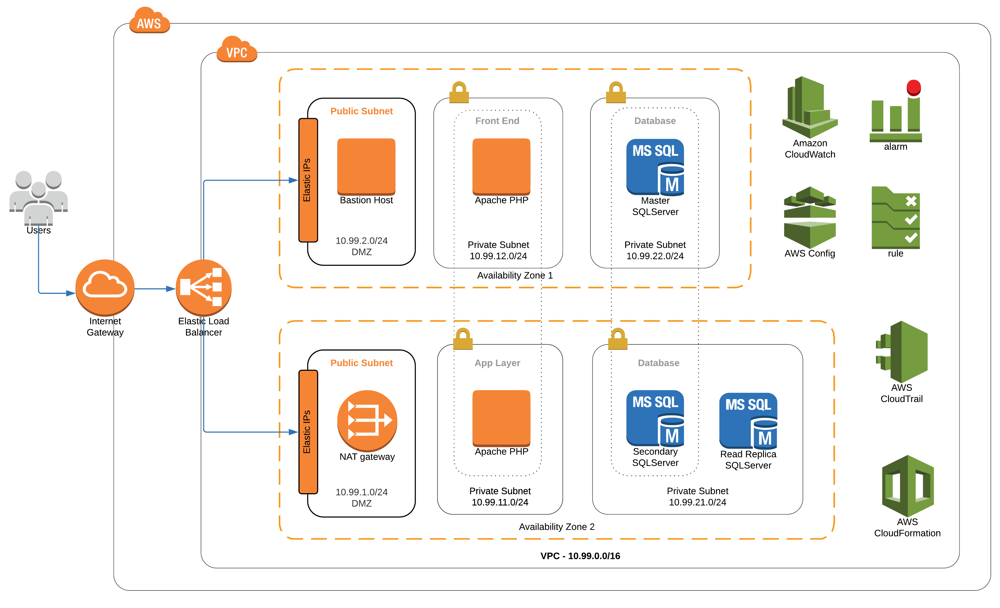
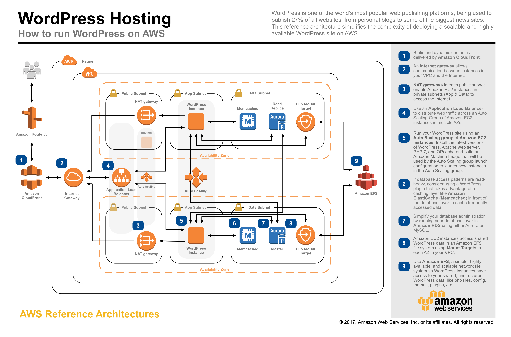

# AWS Reference Architecture Classic

`aws-reference-architecture-classic` is a project that provides an example of a reference architecture in AWS (Amazon Web Services). The architecture is intended to support classic CRUD applications which rely on various application layers (presentation, service, persistence).

The architecture conforms to best practices as recommended by Amazon with regards to security, high availability, monitoring and infrastructure as code,

# Architecture Diagrams

The image below provides a visual representation of the project's architecture.

Additionally, an auto-generated CloudFormation Designer diagram is presented below.

# CloudFormation Template

A [CloudFormation template](aws-reference-architecture-classic-template.yml) is provided which allows for the creation and destruction of the reference architecture within an AWS account.

**NOTE**: Some of the resources that are created as part of the CloudFormation templates are not part of the AWS *Free Tier* (e.g. NAT Gateway, RDS Snapshots) and will incur costs.

# Architectural Resources

The project's architecture is composed of the following resources:

* AWS::AutoScaling::AutoScalingGroup
* AWS::AutoScaling::LaunchConfiguration
* AWS::AutoScaling::ScalingPolicy
* AWS::CloudTrail::Trail
* AWS::CloudWatch::Alarm
* AWS::Config::ConfigRule
* AWS::Config::ConfigurationRecorder
* AWS::Config::DeliveryChannel
* AWS::EC2::EIP
* AWS::EC2::Instance
* AWS::EC2::InternetGateway
* AWS::EC2::NatGateway
* AWS::EC2::NetworkAcl
* AWS::EC2::NetworkAclEntry
* AWS::EC2::Route
* AWS::EC2::RouteTable
* AWS::EC2::SecurityGroup
* AWS::EC2::Subnet
* AWS::EC2::SubnetNetworkAclAssociation
* AWS::EC2::SubnetRouteTableAssociation
* AWS::EC2::VPC
* AWS::EC2::VPCGatewayAttachment
* AWS::ElasticLoadBalancingV2::Listener
* AWS::ElasticLoadBalancingV2::LoadBalancer
* AWS::ElasticLoadBalancingV2::TargetGroup
* AWS::IAM::InstanceProfile
* AWS::IAM::Role
* AWS::Logs::LogGroup
* AWS::RDS::DBInstance
* AWS::RDS::DBSubnetGroup
* AWS::S3::Bucket
* AWS::S3::BucketPolicy
* AWS::SNS::Topic
* AWS::SNS::TopicPolicy

# Project Inspiration

The project takes inspiration from the [AWS reference architecture for WordPress](https://github.com/aws-samples/aws-refarch-wordpress), as recommended by Amazon.

