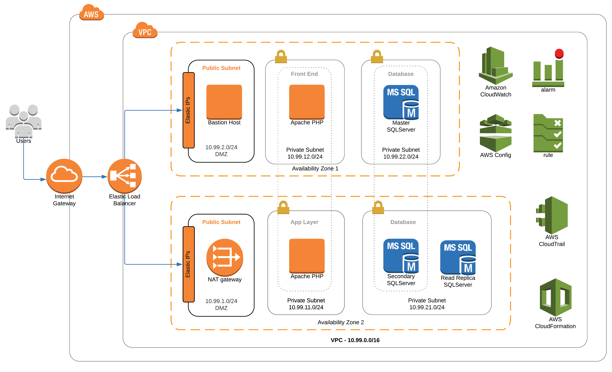
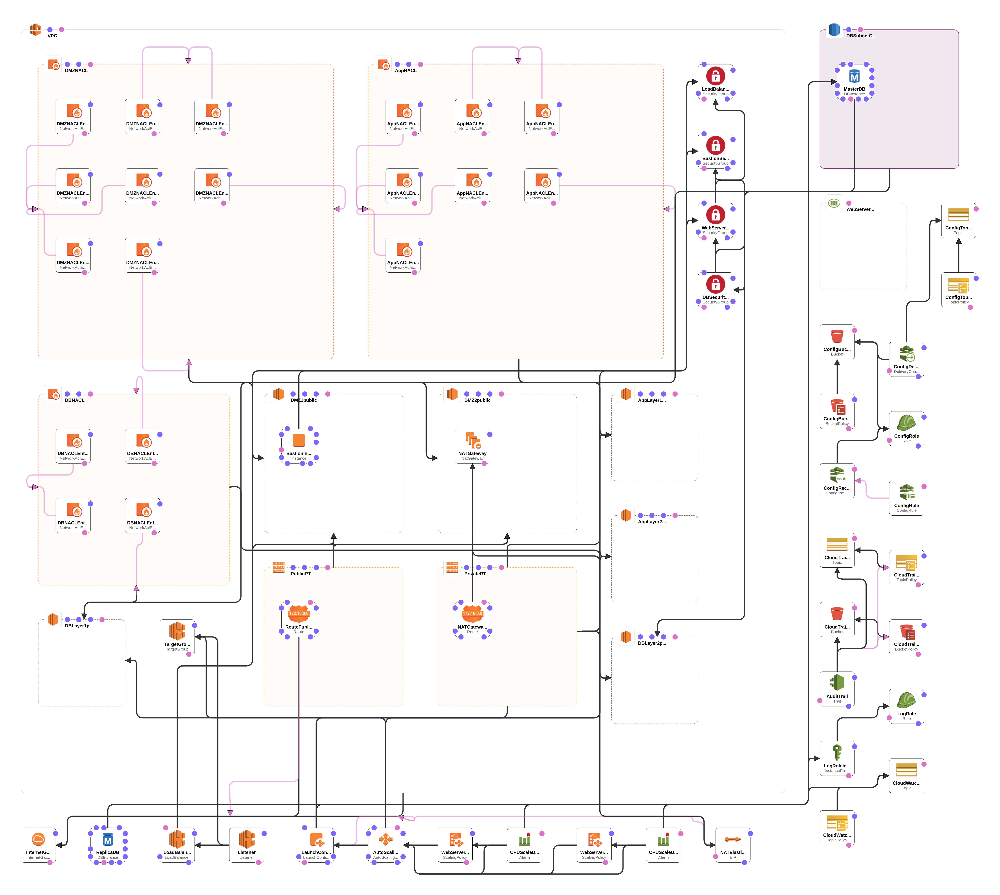

# AWS Reference Architecture Classic

`aws-reference-architecture-classic` is a project that provides an example of a reference architecture in AWS (Amazon Web Services). The architecture is intended to support classic CRUD applications which rely on various application layers (presentation, service, persistence).

The architecture conforms to best practices as recommended by Amazon with regards to security, high availability, monitoring and infrastructure as code,

# Architecture Diagrams

The image below provides a visual representation of the project's architecture.



Additionally, an auto-generated CloudFormation Designer diagram is presented below.



# Prerequisites

* An AWS account with appropriate permissions to create the required resources
* [AWS CLI installed and configured](https://docs.aws.amazon.com/cli/latest/userguide/install-cliv1.html)
* Bash environment in which to execute the scripts

# Deploy the project

## Grab the project 

The first step is to git clone the project.

```bash
git clone --verbose --progress https://github.com/damianmcdonald/aws-reference-architecture-classic aws-reference-architecture-classic
```

## Configure global variables

The second step is to modify any of the global variables to suit your needs.

The global variables are defined in the [aws-deploy.sh](aws-deploy.sh) script.

You will need to update the `AWS_PROFILE` variable to reflect the profile that you have configured in the AWS CLI.

For the remaining global variables, if you just want to have a sandbox environment to experiment with the project then the defaults below are probably fine.

```bash
# Global variable declarations
PROJECT_DIR=$PWD
AWS_PROFILE=<!-- ADD_YOUR_AWS_CLI_PROFILE_HERE -->
AWS_REGION=$(aws configure get region --output text --profile ${AWS_PROFILE})
IAM_CAPABILITIES=CAPABILITY_IAM
STACK_NAME=aws-reference-classic
CFN_STACK_TEMPLATE=stack-template.yml
UNDEPLOY_FILE=aws-undeploy.sh
```

## Create the resources and deploy the project

Create the resources and deploy the project by executing the [aws-deploy.sh](aws-deploy.sh) script.

```bash
./aws-deploy.sh
```

**NOTE**: Some of the resources that are created as part of the CloudFormation templates are not part of the AWS *Free Tier* (e.g. NAT Gateway, RDS Snapshots) and will incur costs.

The project is deployed using a [CloudFormation](stack-template.yml) template. You can following the progress of the project creation using the AWS CloudFormation console.

As part of the execution of the [aws-deploy.sh](aws-deploy.sh) script, one additional file is dynamically created.

Location | Purpose
------------ | -------------
aws-undeploy.sh | Script that can be used to destroy and clean-up all of the resources created by the `aws-reference-architecture-classic` project

# Architectural Resources

The project's architecture is composed of the following resources:

* AWS::AutoScaling::AutoScalingGroup
* AWS::AutoScaling::LaunchConfiguration
* AWS::AutoScaling::ScalingPolicy
* AWS::CloudTrail::Trail
* AWS::CloudWatch::Alarm
* AWS::Config::ConfigRule
* AWS::Config::ConfigurationRecorder
* AWS::Config::DeliveryChannel
* AWS::EC2::EIP
* AWS::EC2::Instance
* AWS::EC2::InternetGateway
* AWS::EC2::NatGateway
* AWS::EC2::NetworkAcl
* AWS::EC2::NetworkAclEntry
* AWS::EC2::Route
* AWS::EC2::RouteTable
* AWS::EC2::SecurityGroup
* AWS::EC2::Subnet
* AWS::EC2::SubnetNetworkAclAssociation
* AWS::EC2::SubnetRouteTableAssociation
* AWS::EC2::VPC
* AWS::EC2::VPCGatewayAttachment
* AWS::ElasticLoadBalancingV2::Listener
* AWS::ElasticLoadBalancingV2::LoadBalancer
* AWS::ElasticLoadBalancingV2::TargetGroup
* AWS::IAM::InstanceProfile
* AWS::IAM::Role
* AWS::Logs::LogGroup
* AWS::RDS::DBInstance
* AWS::RDS::DBSubnetGroup
* AWS::S3::Bucket
* AWS::S3::BucketPolicy
* AWS::SNS::Topic
* AWS::SNS::TopicPolicy

# Project Inspiration

The project takes inspiration from the [AWS reference architecture for WordPress](https://github.com/aws-samples/aws-refarch-wordpress), as recommended by Amazon.


