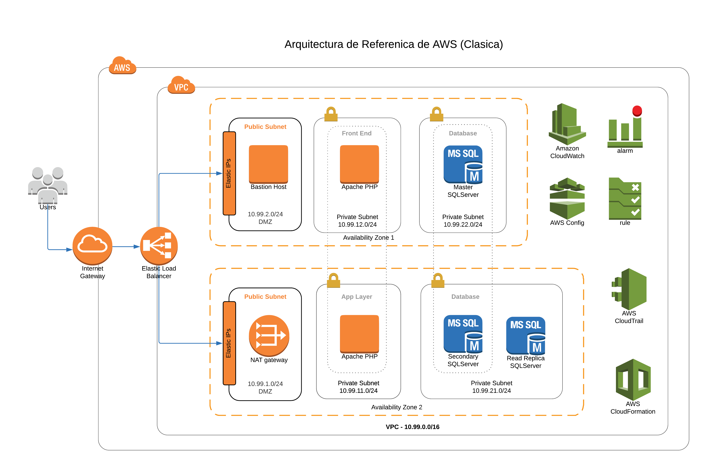
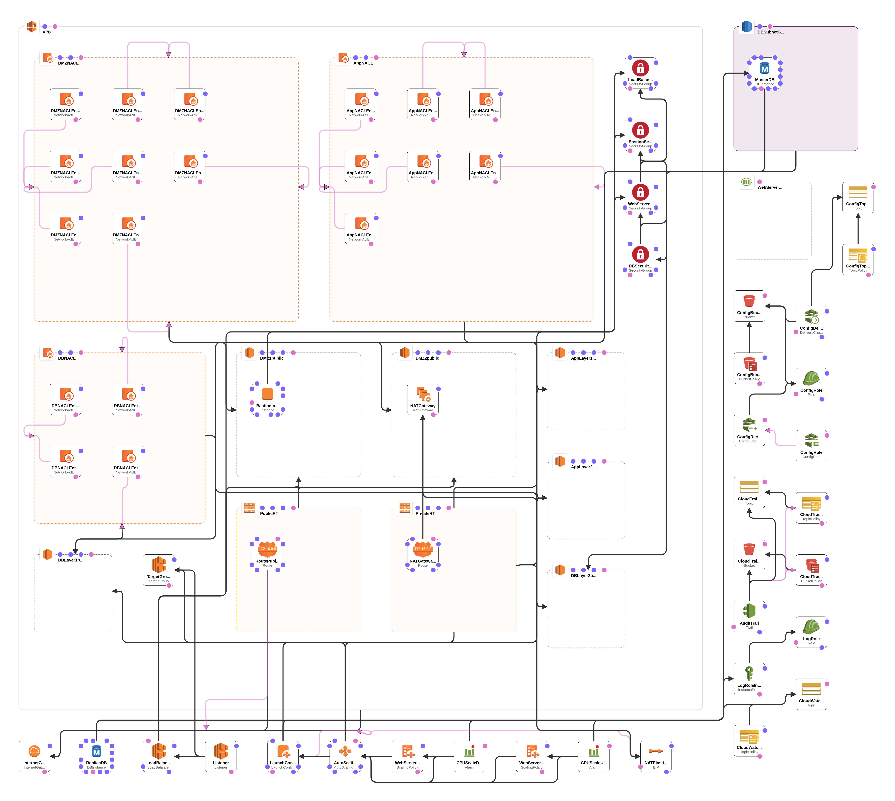

# Arquitectura de referencia de AWS

`aws-reference-architecture` es un proyecto que proporciona un ejemplo de una arquitectura de referencia de AWS. La arquitectura es una arquitectura clasica que puede soportar aplicaciones CRUD con varias capas (presentacion, logica del negocio, persistencia).

La arquitectura sigue las mejores practicas de AWS en cuanto a seguridad, alta disponibilidad, monitoring y infraestructura como codigo.

# Diagramas de la Arquitectura

Se puede ver en la diagrama abajo una representacion visual del proyecto.

Además, se tene la diagram generado por CloudFormation Designer.

# Componentes de la Arquitectura

La arqitectura es compuesto de los siguientes recursos:

* AWS::AutoScaling::AutoScalingGroup
* AWS::AutoScaling::LaunchConfiguration
* AWS::AutoScaling::ScalingPolicy
* AWS::CloudTrail::Trail
* AWS::CloudWatch::Alarm
* AWS::Config::ConfigRule
* AWS::Config::ConfigurationRecorder
* AWS::Config::DeliveryChannel
* AWS::EC2::EIP
* AWS::EC2::Instance
* AWS::EC2::InternetGateway
* AWS::EC2::NatGateway
* AWS::EC2::NetworkAcl
* AWS::EC2::NetworkAclEntry
* AWS::EC2::Route
* AWS::EC2::RouteTable
* AWS::EC2::SecurityGroup
* AWS::EC2::Subnet
* AWS::EC2::SubnetNetworkAclAssociation
* AWS::EC2::SubnetRouteTableAssociation
* AWS::EC2::VPC
* AWS::EC2::VPCGatewayAttachment
* AWS::ElasticLoadBalancingV2::Listener
* AWS::ElasticLoadBalancingV2::LoadBalancer
* AWS::ElasticLoadBalancingV2::TargetGroup
* AWS::IAM::InstanceProfile
* AWS::IAM::Role
* AWS::Logs::LogGroup
* AWS::RDS::DBInstance
* AWS::RDS::DBSubnetGroup
* AWS::S3::Bucket
* AWS::S3::BucketPolicy
* AWS::SNS::Topic
* AWS::SNS::TopicPolicy

# Inspiración

El proyecto ha sido inspirado por la [arquitectura de referencia de WordPress en AWS](https://github.com/aws-samples/aws-refarch-wordpress), recomendado por Amazon.

